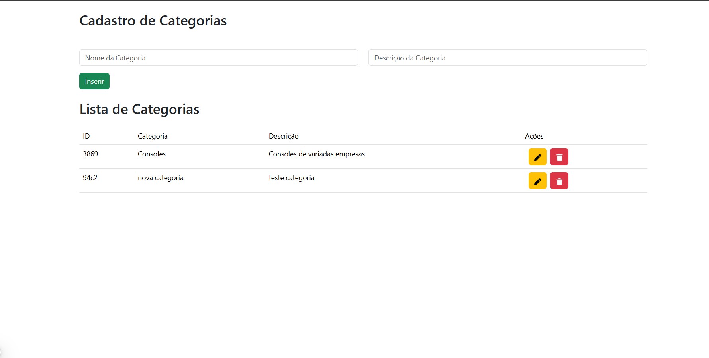

### Next.JS 15 + Bootstrap Ajuste

#### Pages


* rodar o frontend
```
npm run dev
```

* rodar o banco
```
npx json-server banco.json --port 8080
```

* bootstrap
```
npm install bootstrap@5.3.3
```

* font icones
```
https://react-icons.github.io/react-icons/search/#q=trash
npm install react-icons --save
```
